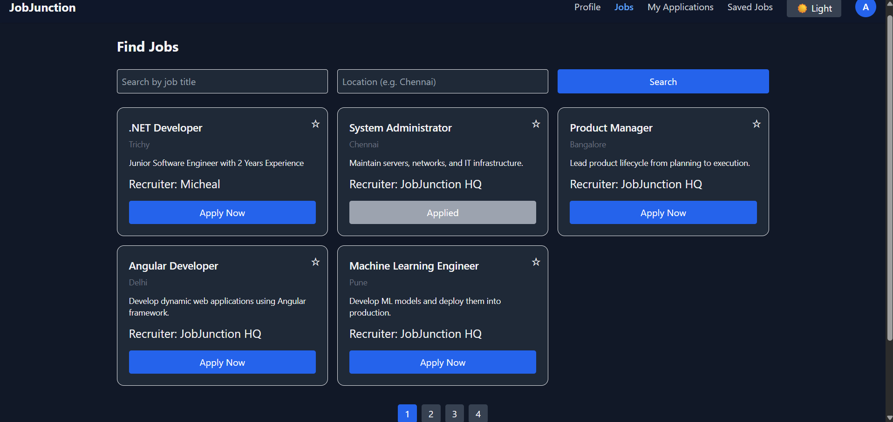
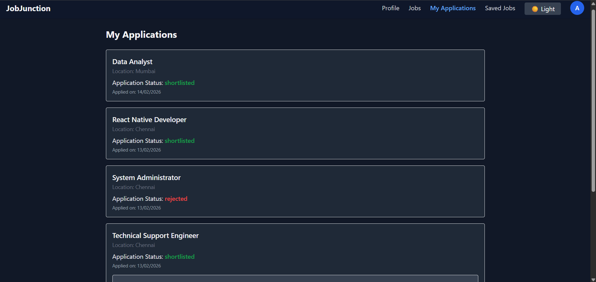
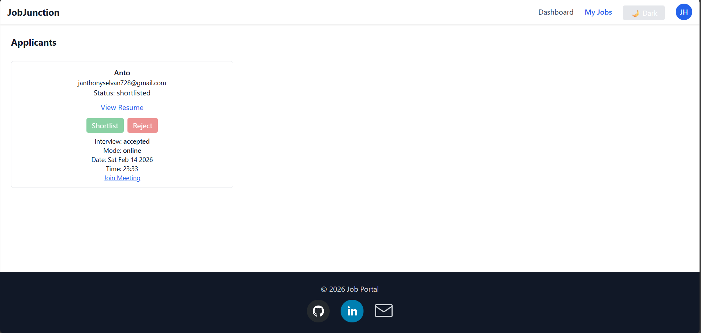
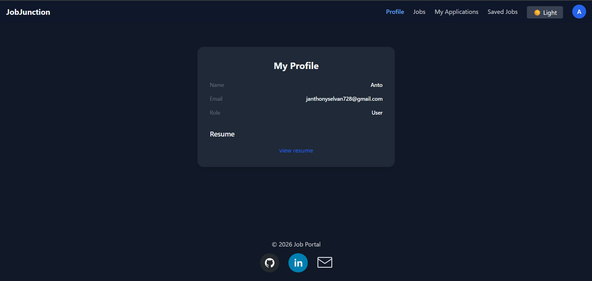
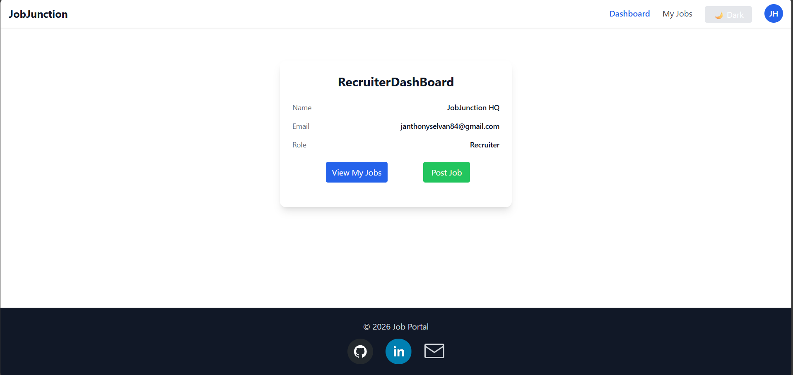
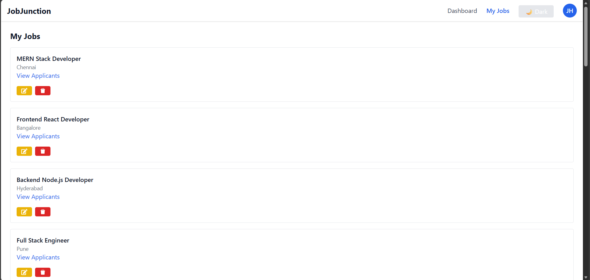

# 🚀 JobJunction – MERN Job Portal

## 🌐 Live Demo

**Frontend (Vercel)**  
👉 https://job-junction-lime.vercel.app/

**Backend (Render)**  
👉 https://mern-job-portal-m2pc.onrender.com/

---

## 📌 Project Overview

JobJunction is a full-stack job portal built with the MERN Stack where:

- 👨‍💼 Users can apply for jobs & upload resumes
- 🏢 Recruiters can post jobs & schedule interviews
- 🛡 Admin can manage recruiters & users
- 📧 Email notifications for interviews & password reset
- ☁ Cloudinary for resume storage
- 🔐 Secure JWT authentication with HTTP-only cookies

---

## ✨ Feature List

### 🔐 Authentication

- Register / Login / Logout
- Role-based access (User / Recruiter / Admin)
- JWT authentication (HTTP-only cookies)
- Forgot password via email
- Reset password with token

---

### 👤 User Features

- Browse & search jobs
- Apply to jobs
- View application status
- Accept / Reject interview
- Upload resume (Cloudinary)
- Save / Bookmark jobs

---

### 🏢 Recruiter Features

- Create / Edit / Delete jobs
- View applicants
- Shortlist / Reject applicants
- Schedule interviews
- Edit / Cancel interview
- Send email notifications

---

### 🛡 Admin Features

- View users
- Approve / Reject recruiters

---

### 🎨 Frontend Features

- Dark mode
- Responsive Navbar (Desktop + Mobile)
- Drawer menu
- Profile dropdown
- Scroll animations
- Footer with social links

---

## ☁ Deployment

- Frontend → Vercel
- Backend → Render
- Database → MongoDB Atlas
- File Storage → Cloudinary
- Email Service → Brevo

---

# 📸 Screenshots

### 🏠 Homepage


### 📋 Jobs Page


### 📝 My Applications


### 👥 Job Applicants


### 👤 Profile Page


### 🧑‍💼 Recruiter Dashboard


### 📂 Recruiter Jobs


---

## 🏗 System Architecture

```
Frontend (React + Vite)
        ↓
Backend API (Node + Express)
        ↓
MongoDB Atlas

File Storage → Cloudinary
Email Service → Brevo

Deployment:
Frontend → Vercel
Backend → Render
```

---

## 🛠 Tech Stack

### Frontend
- React
- Redux Toolkit
- Tailwind CSS
- React Router

### Backend
- Node.js
- Express.js
- MongoDB
- JWT Authentication

### Cloud & Services
- MongoDB Atlas
- Cloudinary
- Brevo
- Render
- Vercel
